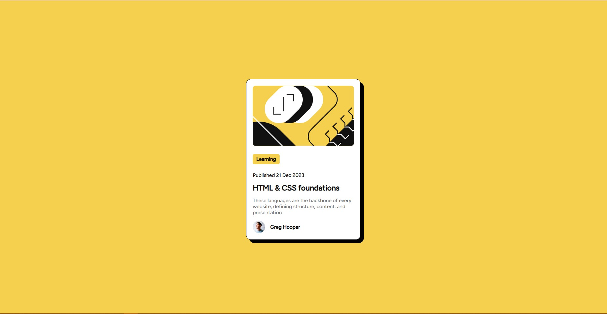
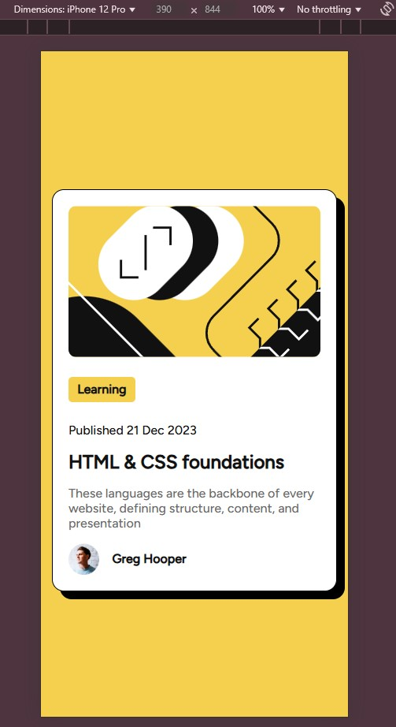

# Frontend Mentor - Blog preview card solution

This is a solution to the [Blog preview card challenge on Frontend Mentor](https://www.frontendmentor.io/challenges/blog-preview-card-ckPaj01IcS).

## Table of contents

  - [The challenge](#the-challenge)
  - [Screenshot](#screenshot)
  - [Links](#links)
  - [Built with](#built-with)

### The challenge
Build a Preview card using HTML and CSS
Users should be able to:
- See hover and focus states for all interactive elements on the page

### Screenshot

 

### Links

- Solution URL: [(https://github.com/VGjonaj/Blog-preview-card]
- Live Site URL: [https://vgjonaj.github.io/Blog-preview-card/]

### Built with

- HTML5
- CSS
- Flexbox
- Font-face

